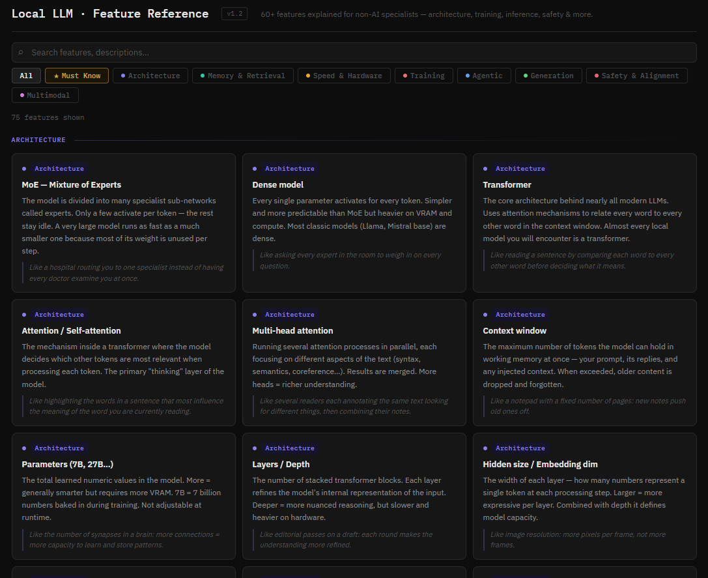

# Local LLM Feature Reference

A self-contained HTML reference guide covering **60+ local LLM features** explained in plain language for developers who are not AI specialists. Built for pasting into Confluence, hosting on any internal wiki, or opening directly in a browser.

  

---

## What's inside

| Category | Topics covered |
|---|---|
| **Architecture** | Transformer, MoE, context window, parameters, tokenization, attention… |
| **Memory & Retrieval** | RAG, embeddings, vector DB, chunking, KV cache, semantic search… |
| **Speed & Hardware** | VRAM, quantization (Q4/Q8), tokens/sec, GGUF, CPU offloading, Flash Attention… |
| **Training** | Fine-tuning, LoRA/QLoRA, RLHF, DPO, SFT, Modelfile/system prompt… |
| **Agentic** | MCP, function calling, agent loop, ReAct, structured output… |
| **Generation** | Temperature, Top-P/K, CoT, thinking mode, hallucination, max tokens… |
| **Safety & Alignment** | Alignment, guardrails, prompt injection, jailbreaking… |
| **Multimodal** | VLM, image encoder, audio/speech models, cross-modal attention… |

Each card includes:
- A **plain-language description** — no assumed AI background
- An **analogy** — maps the concept to something familiar

---

## ★ Must Know filter

A curated gold-highlighted selection of ~20 concepts every developer needs before starting to use local LLMs — no deep understanding required. Covers the absolute essentials: context window, VRAM, quantization, RAG, temperature, hallucination, MCP, LoRA, and more.

---

## Usage

### Option 1 — Confluence HTML macro
1. Open a Confluence page in edit mode
2. Insert macro → search **HTML** (requires the HTML Macro plugin)
3. Paste the full contents of `llm_features_guide.html`
4. Save

> If your Confluence instance blocks the HTML macro, ask an admin to whitelist it, or use the **Scroll HTML** or **Widget Connector** macro as an alternative.

### Option 2 — Standalone page
Open `llm_features_guide.html` directly in any browser. No server needed.

### Option 3 — Internal hosting
Drop the file on any static host (S3, GitHub Pages, Nginx). No build step, no dependencies beyond the Google Fonts import.

---

## Features

- **Filter by category** — Architecture, Memory & Retrieval, Speed & Hardware, Training, Agentic, Generation, Safety & Alignment, Multimodal
- **★ Must Know** — curated essential subset, gold-highlighted
- **Live search** — filters cards by title and description in real-time
- **Zero dependencies** — one HTML file, Google Fonts import only (works offline if fonts are cached)
- **Dark greyscale theme** — easy on the eyes in dim studio environments

---

## Customisation

All data lives in the `DATA` array in the `<script>` block. Each entry:

```js
{
  cat: 'speed',       // category key
  mustknow: true,     // include in ★ Must Know filter
  title: 'VRAM',      // card title
  desc: '...',        // plain-language description
  analogy: '...'      // optional analogy line
}
```

Category colours and labels are in the `CATS` object. Theme variables are CSS custom properties at the top of the `<style>` block.

---

## Changelog

| Version | Changes |
|---|---|
| v1.1 | Greyscale dark theme · compact header · ★ Must Know filter with gold glow · must-know cards highlighted in all-category view |
| v1.0 | Initial release — 60+ features, 8 categories, search + filter |

---

## License

MIT — free to use, adapt, and redistribute. Attribution appreciated but not required.